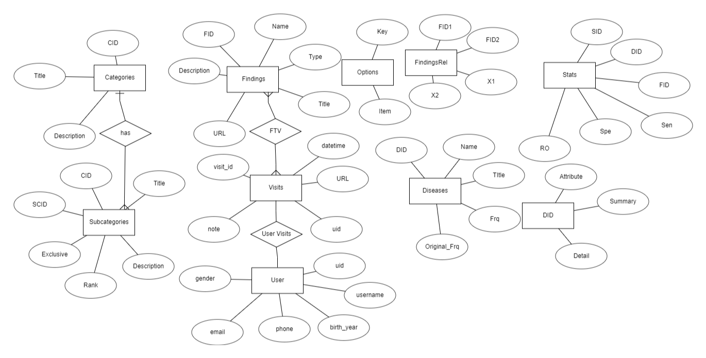

# Backend

> Documents for backend development


## Contents

* [Launch Server](#launch)
  * [Development Server](#development)
* [Database](#db)
  * [Erd](#erd)
  * [Table Creation Sql](#sql)
* [Endpoints](#endpoints)
  * [User Endpoints](#user-endpoints)
* [Models](#models)
  * [UserModel](#usermodel)
  * [CategoriesModel](#categoriesmodel)
  * [DiseasesModel](#diseasemodel)
  * [FindingsModel](#findingsmodel)
  * [Findingsrel](#findingsrel)
  * [StatsModel](#statsmodel)
  * [subCategories](#subcategories)
  * [VisitModel](#visitmodel)
  * [VisitToFindingModel](#visittofinding)
  
  


<a id="launch"></a>
## Launch Server

<a id="development"></a>
### Development Server

> Development Server will be launched by raw flask

#### Steps

0. copy the database from developer to `backend_sqlalchemy/backend_app/data`
1. `$ cd backend_sqlalchemy`
2. if no virtual environment create then `$ virtualenv .venv`
3. activate virtual environment
   * for windows `$ .\.venv\Scripts\activate`
   * for linux based system `$ source .venv/bin/activate`
4. if open the virtual environment in first time then `$ pip install -r requirements.txt`
5. input (export) the system variables to environment:
   1. the SMTP email password
   2. the flask secret key
6. `$ python run.py`


<a id="db"></a>
## Database
> Database for this app contains two main parts, user and algorithm. User part will be mainly for user information and authentication. Algorithm will be mainly for NextBestQuestion and FindDisease algorithm. 


<a id="erd"></a>
### ERD




<a id="sql"></a>
#### Table CreationSql
> original table was created by professor. the following sql is for creating table after it.

```sql
CREATE TABLE User
(
  uid INTEGER PRIMARY KEY,
  username VARCHAR(30) NOT NULL,
  password VARCHAR(16) NOT NULL,
  email VARCHAR(50) NOT NULL,
  birth_year INTEGER NOT NULL,
  gender VARCHAR(20) NOT NULL,
  phone VARCHAR(30),
  UNIQUE (username),
  UNIQUE (email)
);

CREATE TABLE Visit
(
  visit_id INTEGER PRIMARY KEY,
  datetime DATE NOT NULL,
  note VARCHAR(280) NOT NULL,
  uid INTEGER NOT NULL,
  FOREIGN KEY (uid) REFERENCES User(uid)
);

CREATE TABLE VisitToFinding
(
  answer VARCHAR(20) NOT NULL,
  position INTEGER NOT NULL,
  visit_id INTEGER NOT NULL,
  FID INTEGER NOT NULL,
  FOREIGN KEY (visit_id) REFERENCES Visit(visit_id),
  FOREIGN KEY (FID) REFERENCES Findings(FID)
);
```
<a id="endpoints"></a>
## Endpoints

<a id="user-endpoints"></a>
### User Endpoints
> [endpoint resource](../backend_app/resources/user.py)

* post "/user/register"
  * success: {msg: "..."}, status 201
  * exception: {msg: "..."}, status 409
* post "/user/login"
  * success: {msg: "..."}, status 200
  * exception: {msg: "..."}, status 401
* post "/user/forget_password"
  * success: {msg: "..."}, status 200
  * exception: 
    * no email in record: {msg: "..."}, status 401
    * internal error when sending email: {msg: "..."}, status 500
  * put "/user/change_password"
    * success: {msg: "..."}, status 200
    * exception: {msg: "..."}, status 404


<a id="models"></a>
## Models

<a id="usermodel"></a>
### UserModel
> mapped from User table

#### Attributes

* uid: primary key auto increment
  * type: int not null
* username: unique not null
  * type: string
* email: unique not null
  * type: string
* password: encrypted not null
  * type: string
* birth_year: 
  * type: int
* phone: 
  * type: string
  

<a id="categoriesmodel"></a>
### CategoriesModel
> mapped from Categories table

#### Attributes
* CID: primary key
  * type: int
* title: 
  * type: numeric
* Description:
  * type: text
  


<a id="diseasesmodel"></a>
### DiseasesModel
> mapped from Diseases table

#### Attributes
* DID: primary key, unique
  * type: int
* Name: unique, not null 
  * type: text
* Title: 
  * type: text
* Frq: 
  * type: int
* Original_Frq: 
  * type: int
* URL:
  * type: text
  
<a id="findingsmodel"></a>
### FindingsModel
> mapped from Findings table

#### Attributes
* FID: primary key, not null, unique
  * type: int
* Name: 
  * type: text
* Type: 
  * type: int
* Title: 
  * type: text
* Description: 
  * type: text
* URL: 
  * type: text
  
<a id="findingsrel"></a>
### FindingsRel
> mapped from FindingsRel table

#### Attributes
* FID1: primary key, unique
  * type: int
* FID2: primary key, unique
  * type: int
* X1: 
  * type: int
* X2:
  * type: int
  
<a id="statsmodel"></a>
### StatsModel
> mapped from Stats table

#### Attributes
* SID: primary key, unique
  * type: int
* DID: unique
  * type: int
* FID: unique
  * type: int
* Sen:
  * type: real
* Spe: 
  * type: real
* RO:
  * type: real
  
<a id="subcategories"></a>
### subcategories
> mapped from Subcategories table

#### Attributes
* SCID: primary key,not null, unique
  * type: int
* CID: 
  * type: int
* Title: 
  * type: real
* Description: 
  * type: text
* Rank:
  * type: int
  
* Exclusive:
  * type: real
  
<a id="visitmodel"></a>
### visitModel
> mapped from visit table

#### Attributes
* visit_id: primary key
  * type: int
* datetime: not null
  * type: text
* node: 
  * type: string
* uid: not null
  * type: int
  

<a id="visittofindingmodel"></a>
### VisitToFindingModel
> mapped from VisitToFinding table

#### Attributes
* answer: 
  * type: string
  
* position: 
  * type: int
  
* visit_id: primary key
  * type: int

* FID: 
  * type: int
  
  

  
  
  
